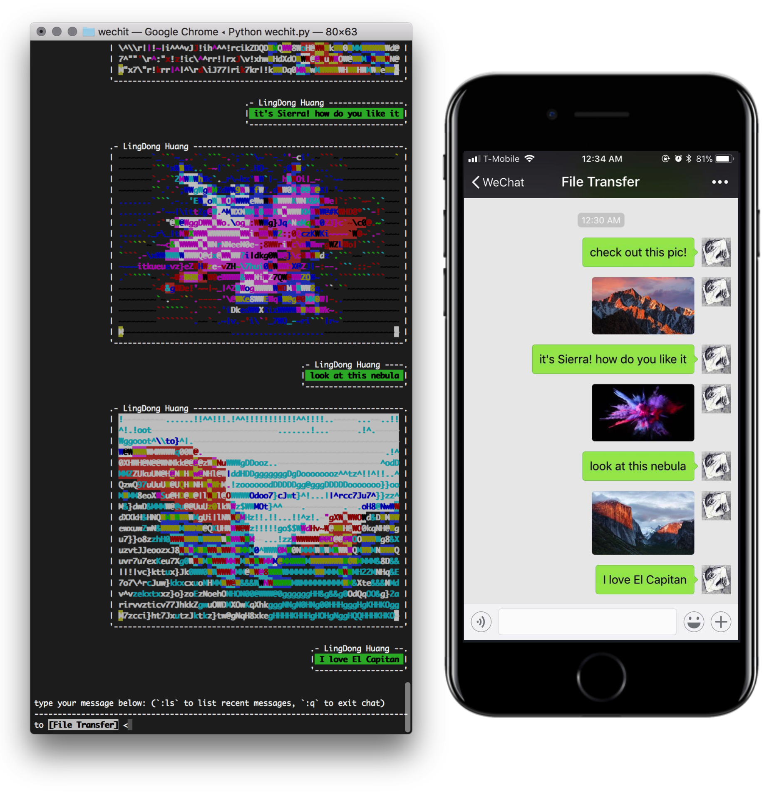
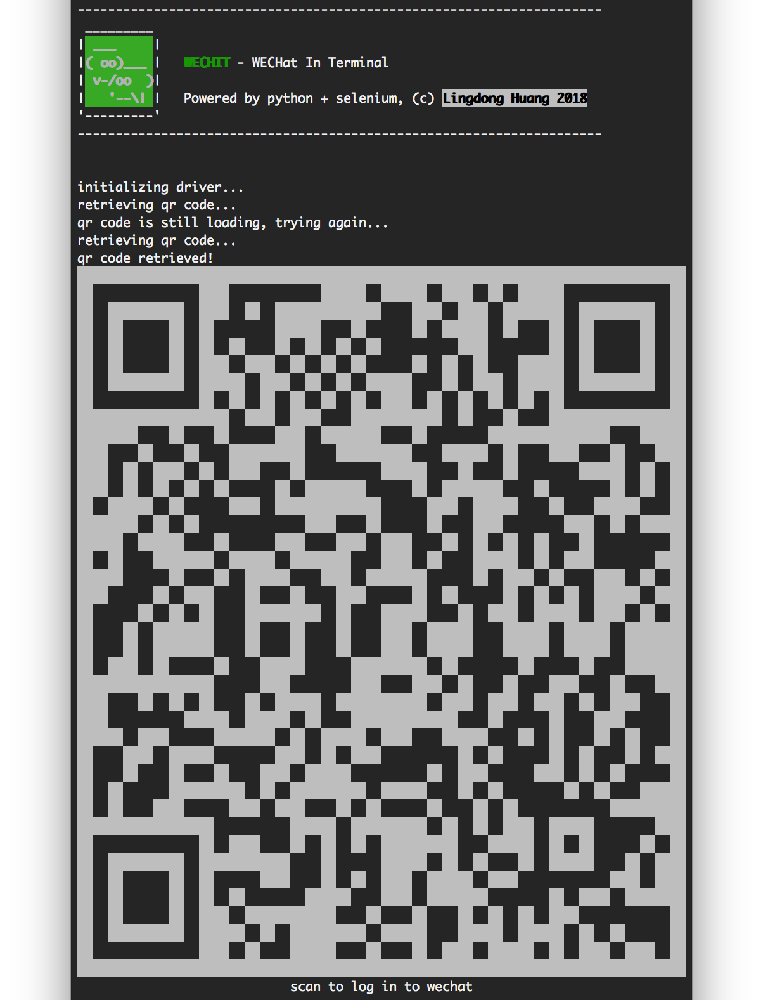
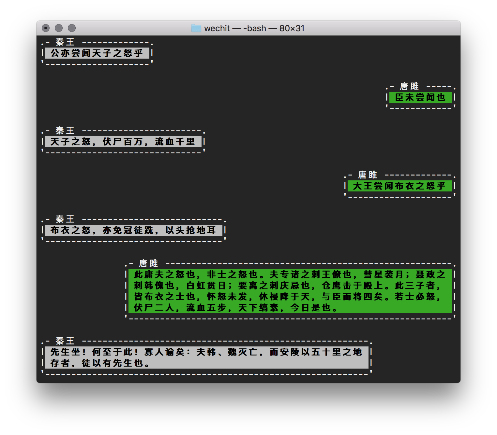

# WECHIT 

*- WEChat In Terminal 微信终端版*

Alternative WeChat client right in your terminal. Socialize without ever leaving the command line. Send and receive messages, files and images (as ASCII art). Add your own scripts to automate batch sending and broadcasting messages, or just write an AI to socialize for you.



## How it works

WeChit controls a hidden [Google Chrome](https://www.google.com/chrome/) instance in the background via [Selenium](https://www.seleniumhq.org). It punches buttons and fetch data from [WeChat for Web](https://web.wechat.com) and feed it to your terminal. Your input is then automatically sent back for further interactions. Images are available for terminals supporting ANSI colors, and are rendered using custom ASCII-art engine.


## Features

### Log In from Terminal


### Send Text and Images


### Multilingual Support



## Usage

### Dependencies

- [Python](https://www.python.org) 2 or 3. 
- [Selenium](https://selenium-python.readthedocs.io/installation.html) `pip install selenium`
- [PIL/Pillow](https://pillow.readthedocs.io/en/5.2.x/) `pip install pillow`
- [Google Chrome](https://www.google.com/chrome/) and [Chrome Driver](https://sites.google.com/a/chromium.org/chromedriver/downloads)

Mainly tested on macOS 10.13, ChromeDriver 2.41.578706, Python 3.6.5 and Python 2.7.15, but should work on other OS and set-up too. Other browser drivers (e.g. Safari, Firefox, etc.) may be used in place of ChromeDriver, but is untested and requires modifying source.

### Installation

- Clone this repo and `cd` into it.
- Place the chrome driver executable in top-level `wechit/` folder.
- Run `python wechit.py` to start the client.


### Configure (Optional)

- WeChit use ASCII art with ANSI colors to display images in the terminal. It decides what character and color combinations to use by looking up a pre-generated table stored in `colormap.json`. This table is somewhat specific to the font being used by the terminal. The table packaged with Wechit is generated based on the `Monaco` typeface. If you would like to generate a new table tuned to another font, you can run `python term_colormeter.py path/to/my/font.ttf` to do so.


## Custom Scripts

Besides running `wechit.py` as a commandline app, you can also import it as a python module and write your own script to automate sending messages. For example, use this script to harass your favorite frenemy by sending them the same message 100 times.

```python
import time
import wechit

recipent = "Bob"
message = "I love you"

print("initializing...")
    
# initialize driver
driver = wechit.init_driver()

# wait for page to load
time.sleep(1)

# fetch the qr code
im = wechit.get_qr_code(driver)

# display qr code
print(wechit.print_qr_code(im))

# wait for chat window to load
wechit.wait_for_chat_window(driver)
print("logged in as \""+wechit.get_username(driver)+"\"! loading chats...")

# start conversation with recipent
ret_name = wechit.goto_conversation(driver, recipent)
print("ok. now you're chatting with someone called \"%s\"."%(wechit.render_unicode(wechit.no_emoji(ret_name))))

# send the messages
for i in range(100):
    print("sending message:",message)
    wechit.send_message(driver,message)
    print("sent!")

```

More examples can be found in `./examples` folder. e.g. try `python examples/broadcast.py`

